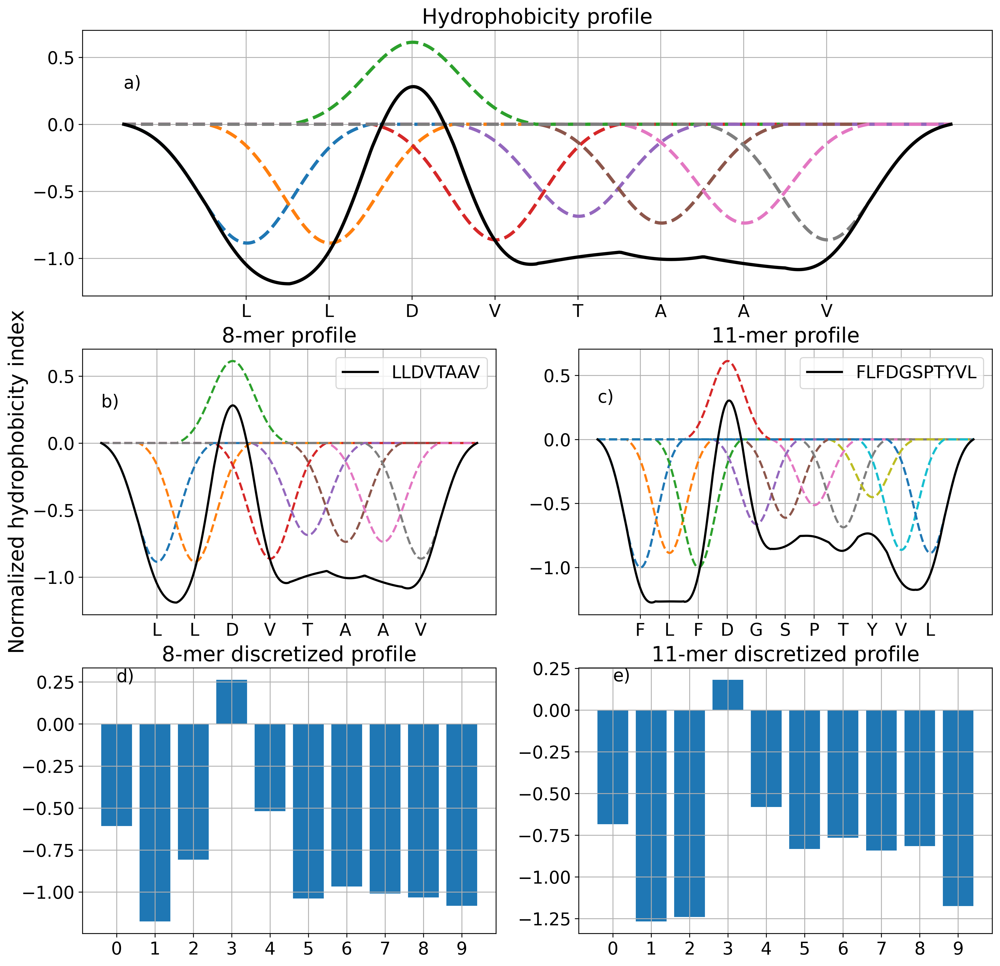
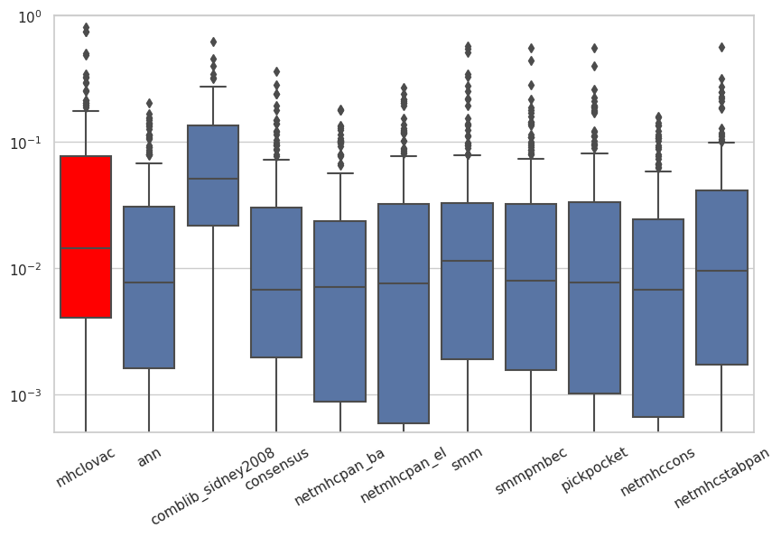

# MHCLovac

[](https://pepy.tech/project/mhclovac)
[](https://pepy.tech/project/mhclovac)

MHC binding prediction based on modeled physicochemical properties of peptides.

`bitcoin: bc1qrg7wku5g35kn0qyay4uwzugfmfqwnvz95g54pj`

### Table of content
* [Introduction](#introduction)
* [Methods and materials](#methods-and-materials)
  * [Modeling physicochemical properties](#modeling-physicochemical-properties)
  * [Prediction model](#prediction-model)
  * [Feature selection](#feature-selection)
* [Results](#results)
* [Release notes](#release-notes-version-40)
* [Installation](#installation)
* [Usage](#usage)
* [References](#references)

### Introduction

Molecules of major histocompatibility complex (MHC) help the adaptive immune system recognize the foreign peptides by presenting them on the surface of the cells where they are accessible to the surveillance activity of the T cells.
The interaction of MHC molecules and the peptides  depends on number of factors including position of the charged residues in the peptide and interactions with the hydrophobic pocket of MHC molecules (Rothbard, J. B., Gefter, M. L., 1991). 
Here I present a MHC binding prediction method that focuses on those physicochemical properties of peptides which facilitate interaction with MHC molecules.
This method is based on modeling physicochemical properties of peptides in a way that reflects the nearest neighbor effects of amino acid properties. 
In other words this method assumes the following: physicochemical properties of adjacent amino acid residues have additive effect on the local properties of the peptide as a whole and properties of a single residue affect the properties of the peptide as a whole at the neighboring positions. 
This assumption implies a distinction between the properties of underlying amino acid residues and those of a peptide as a whole. 
While the nearest neighbor effect has been suggested in case of hydrophobicity of amino acid residues (Kovacs J. M. et al, 2006) the same principle is here applied to other phycicochemical properties. 
Using this approach each peptide is represented by a set of modeled physicochemical profiles which can be further reduced to the fixed number of discrete data points. 
This allows for direct comparison of physicochemical profiles of peptides regardless of sequence lengths which is one major advantage of MHCLovac over other binding prediction tools. 

### Methods and materials

Quantitative binding data was obtained in two parts from IEDB (Vita R et. al., 2018). 
The first is the dataset  used for retraining the IEDBs class I MHC binding prediction tools, obtained from IEDB website, which contains some 189000 data samples. 
The second is the MHC ligand assay dataset from which some 160000 samples were identified as class I MHC ligands and had quantitative binding measurements available. 
Data from the two datasets were combined to yield 286144 unique samples which were used to train MHCLovac. 
The list of physicochemical properties and corresponding amino acid index data was obtained from the Aaindex database (Kawashima, S. et. al, 2008). 
As a preprocessing step, every index was standardized in order to emphasize the distinction between index values of different amino acid residues on same or opposite sides of the spectrum.  

#### Modeling physicochemical properties
A peptide of length L is model by creating a vector S containing L * m + 2 * m data points, where m is an arbitrary multiplier. 
Each amino acid residue gets a designated slice of the vector S corresponding to its relative position in the sequence. 
The ith amino acid residue Ai is modeled as a Gaussian curve G(Ai) scaled by the corresponding index value G(Ai) * IA (Figure 1.a, dashed colored lines). 
Each G(Ai) is shaped by sigma parameter with default value of 0.8  and spans one neighboring slice on each side of the slice of Ai , ex. S[Ai-1:Ai+1]. 
The physicochemical profile of the peptide is obtained by taking the sum of individually modeled residues (Figure 1.a, black solid line). 
The leading and trailing slices, corresponding to + 2 * m term in the first expression, are used as placeholders for modeling the first and the last residue. 
These slices are optionally removed to produce the final vector of length L * m (not shown in the figure).



Once the physicochemical profile is obtained, it can be further reduced to the fixed number of discrete points. 
To give an example, two ligands of HLA-A*02:01 are modeled, an 8-mer LLDVTAAV  and 11-mer FLFDGSPTYVL (Figure 1.b and 1.c). 
By sampling the modeled profiles at equal intervals their profiles are reduced to 10 discrete points each (Figure 1.d and 1.e) which are used as input features for prediction model. 

#### Prediction model
MHCLovac uses a collection of out-of-the-box machine learning algorithms from scikit-learn python library. 
The prediction model returns binding scores in form of log transformed binding affinity (1 – log50k(ic50)). 

#### Feature selection
Since the Aaidex database contains more than 500 entries, to reduce the number of physicochemical properties needed to model, I implemented the following evaluation method. 
For each physicochemical property index, the binding model was trained and evaluated using r2 score for all MHC alleles, and the average score across the alleles was calculated. 
The indexes were sorted based on the average score in decreasing order. 
Starting from the top scoring index, each next index was compared to the previously selected ones for correlation coefficient. 
Only if correlation coefficient with all indexes from selection was in range [-0.3, 0.3] the new index was added to the selection. 
This resulted in total of 9 indexes (table 1) which had high average scoring potential and were also low-correlated between themselves. 

| Accession number  | Title | Average r2 score |
| ------------- | ------------- | ------------ |
| HOPT810101  | Hydrophilicity value (Hopp-Woods, 1981)  | 0.2790 |
| ZIMJ680104  | Isoelectric point (Zimmerman et al., 1968)  | 0.2662 |
| KARS160105  | Average eccentricity (Karkbara-Knisley, 2016)  | 0.2466 |
| TANS770107  | Normalized frequency of left-handed helix (Tanaka-Scheraga, 1977)  | 0.2306 |
| ISOY800104  | Normalized relative frequency of bend R (Isogai et al., 1980)  | 0.2224 |
| VELV850101  | Electron-ion interaction potential (Veljkovic et al., 1985)  | 0.2001 |
| MAXF760103  | Normalized frequency of zeta R (Maxfield-Scheraga, 1976)  | 0.1916 |
| RACS820104  | Average relative fractional occurrence in EL(i) (Rackovsky-Scheraga, 1982)  | 0.1827 |
| CHAM830102  | A parameter defined from the residuals obtained from the best correlation of the Chou-Fasman parameter of beta-sheet (Charton-Charton, 1983) | 0.1709 |

### Results
Prediction accuracy of MHCLovac is evaluated using the same FRANK method and data set that was used to evaluate NetMHCPan 4.1 (Reynisson, B. et. al., 2020). 
In short, FRANK method is used to calculate a fraction of non-epitopes from the same sequence as the epitope which score higher than the epitope. 
The non-epitopes are represented by all overlapping peptides of the same length as the epitope derived from the same protein sequence. 
The FRANK score ranges from 0 to 1, 0 being the best possible score meaning that the epitope is the highest scoring peptide from the sequence. 
MHCLovac is compared to collection of MHC class I prediction tools from IEDB toolkit bundle including ANN, …  
The results are shown on the figure 2. 



### Release notes (version 4.0)
* Training data is better cleaned and prepared, duplicate samples are removed and MHC allele names are standardized.
* Ligand prediction from the previous version was removed due to training data not being properly cleaned. 
* Binding score is reported as the log transformed binding affinity: `1 - log50k(ic50)`.


### Installation

```
pip install mhclovac
```

### Usage

As command line tool:
```
mhclovac -f example.fasta -m HLA-B*44:02 -l 11
```

As python library:
```python
from mhclovac import predict
from mhclovac.utils import list_mhc_alleles

alleles = list_mhc_alleles()
# returns list of supported MHC alleles

predictions = predict(sequence=['MEIFIEVFSHF', 'ELTLNMCL'], mhc='HLA-B*44:02')
# returns pandas DataFrame with prediction results

```

Example output:
```
peptide          mhc  peptide_length           sequence_name  binding_score
MEIFIEVFSHF  HLA-B*44:02              11  MEIFIEVFSHF HLA-B44:02       0.633975
LEKSLMISSQV  HLA-B*44:02              11  MEIFIEVFSHF HLA-B44:02       0.380854
TELTLNMCLEL  HLA-B*44:02              11  MEIFIEVFSHF HLA-B44:02       0.369776
IEVFSHFLLQL  HLA-B*44:02              11  MEIFIEVFSHF HLA-B44:02       0.348047
LELPTGSLEKS  HLA-B*44:02              11  MEIFIEVFSHF HLA-B44:02       0.324328

```

Columns:
1. `peptide` 
2. `sequence_name` - Fasta sequence name or name provided by `-n` argument
3. `peptide_length` -
4. `mhc` - MHC allele name
5. `binding_score` - Higher score means better binding

### References
* Rothbard, J. B., & Gefter, M. L. (1991). Interactions between immunogenic peptides and MHC proteins. Annual review of immunology, 9(1), 527-565.
* Kovacs, J. M., Mant, C. T., & Hodges, R. S. (2006). Determination of intrinsic hydrophilicity/hydrophobicity of amino acid side chains in peptides in the absence of nearest‐neighbor or conformational effects. Peptide Science: Original Research on Biomolecules, 84(3), 283-297.
* Vita R, Mahajan S, Overton JA, Dhanda SK, Martini S, Cantrell JR, Wheeler DK, Sette A, Peters B. The Immune Epitope Database (IEDB): 2018 update. Nucleic Acids Res. 2018 Oct 24. doi: 10.1093/nar/gky1006. [Epub ahead of print] PubMed PMID: 30357391.
* Kawashima, S., Pokarowski, P., Pokarowska, M., Kolinski, A., Katayama, T., and Kanehisa, M.; AAindex: amino acid index database, progress report 2008. Nucleic Acids Res. 36, D202-D205 (2008). [PMID:17998252]
* Reynisson, B., Alvarez, B., Paul, S., Peters, B., & Nielsen, M. (2020). NetMHCpan-4.1 and NetMHCIIpan-4.0: improved predictions of MHC antigen presentation by concurrent motif deconvolution and integration of MS MHC eluted ligand data. Nucleic Acids Research.


