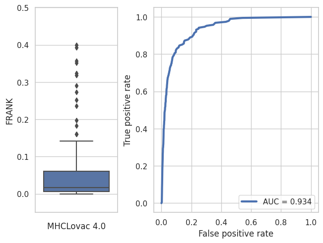

# MHCLovac

[](https://pepy.tech/project/mhclovac)
[](https://pepy.tech/project/mhclovac)

MHC binding prediction based on modeled physicochemical properties of peptides.

`bitcoin: bc1qrg7wku5g35kn0qyay4uwzugfmfqwnvz95g54pj`

### Release notes (version 4.0)
* Training data is obtained from [NetMHCPan website](http://www.cbs.dtu.dk/suppl/immunology/NAR_NetMHCpan_NetMHCIIpan/). This data set contains more than 4 million samples for which binding affinity measurements are directly available.
* Ligand prediction from the previous version was removed due to training data not being properly prepared. 
* Binding score is reported as the log transformed binding affinity: `1 - log50k(affinity)`.

### Table of content
* [Introduction](#introduction)
* [Methods and materials](#methods-and-materials)
  * [Modeling physicochemical properties](#modeling-physicochemical-properties)
  * [Prediction model](#prediction-model)
  * [Feature selection](#feature-selection)
* [Results](#results)
* [Installation](#installation)
* [Usage](#usage)
* [References](#references)

### Introduction

Molecules of major histocompatibility complex (MHC) help the adaptive immune system recognize the foreign peptides by presenting them on the surface of the cells where they are accessible to the surveillance activity of the T cells.
The interaction of MHC molecules and the peptides depends on number of factors including position of the charged residues in the peptide and hydrophobic interactions with the pocket of MHC molecules. 
MHCLovac is an MHC binding prediction method that focuses on physicochemical properties that facilitate interaction between a peptide and MHC molecules.
This method is based on modeling physicochemical properties of peptides in a way that captures the nearest neighbor effect of amino acid residues. 
In other words, this method is based on the following hypothesis: physicochemical properties of adjacent amino acid residues have additive effect on the local properties of the peptide as a whole, and properties of a single residue affect the properties of the peptide at the neighboring positions. 
Using this approach each peptide is represented by a set of modeled physicochemical profiles (distributions of certain property) which are further reduced to the fixed number of discrete data points to obtain discrete physicochemical profiles. 
Discrete profiles are used as input features for binding prediction models.
This method allows for direct comparison of physicochemical profiles of peptides of different sequence lengths, which is an important feature of MHCLovac. 

### Methods and materials

Quantitative binding data was obtained from two sources: quantitative binding measurements from IEDB database [(Vita R et. al., 2018)](https://doi.org/10.1093/nar/gky1006) and data set used for training NetMHCPan 4.1 [(Reynisson, B. et. al., 2020)](https://doi.org/10.1093/nar/gkaa379).
The IEDB data set was used to select the set of physicochemical properties that will be used for prediction. 
The NetMHCPan data set was used to train prediction models. 
The list of physicochemical properties and corresponding amino acid index data was obtained from the Aaindex database [(Kawashima, S. et. al, 2008)](https://doi.org/10.1093/nar/gkm998). 

#### Modeling physicochemical properties
A peptide of length `L` is model by creating a vector `S` containing `L*m + 2*m` data points, where `m` is an arbitrary multiplier. 
Each amino acid residue gets a designated slice of the vector `S` corresponding to its relative position in the sequence. 
The ith amino acid residue `Ai` is modeled by a Gaussian curve `G(Ai)` scaled by the corresponding index value `G(Ai)*IA` (Figure 1.a, dashed colored lines). 
Each `G(Ai)` is shaped by sigma parameter with default value of 0.8  and spans one neighboring slice on each side of the slice of `Ai` , ex. `S[Ai-1:Ai+1]`. 
The physicochemical profile of the peptide is obtained by taking the sum of individually modeled residues (Figure 1.a, black solid line). 
The leading and trailing slices, corresponding to `+ 2*m` term in the first expression, are used as placeholders for modeling the first and the last residue. 
These slices are optionally removed to produce the final vector of length `L*m` (not shown in the figure).
Once the physicochemical profile is obtained, it is further reduced to the fixed number of discrete points. 
To give an example, two ligands of HLA-A*02:01 are modeled, an 8-mer LLDVTAAV  and 11-mer FLFDGSPTYVL (Figure 1.b and 1.c). 
By sampling the modeled profiles at equal intervals their profiles are reduced to 10 discrete points each (Figure 1.d and 1.e), which are used as input features for prediction model. 


#### Prediction model
MHCLovac uses a collection of out-of-the-box regression algorithms from `scikit-learn` python library with mostly default parameters.
The prediction model returns binding scores in form of log transformed binding affinity (1 – log50k(affinity)). 

#### Feature selection
Since the Aaidex database contains more than 500 entries, to reduce the number of physicochemical properties needed to model, the following selection method is implemented. 
For each physicochemical property index, the binding model was trained and evaluated using r2 score for each MHC allele, and the average score across all alleles was calculated. 
The indexes were sorted based on the average score in descending order. 
Starting from the highest scoring index (selected by default), each next index was compared to the previously selected ones for correlation coefficient. 
Only if correlation coefficients with all indexes from selection were in range [-0.3, 0.3] the new index was added to the selection. 
This resulted in total of 9 indexes (table 1) which had high prediction potential and were also low-correlated between themselves. 

| Accession number  | Title | Average r2 score |
| ------------- | ------------- | ------------ |
| HOPT810101  | Hydrophilicity value (Hopp-Woods, 1981)  | 0.2790 |
| ZIMJ680104  | Isoelectric point (Zimmerman et al., 1968)  | 0.2662 |
| KARS160105  | Average eccentricity (Karkbara-Knisley, 2016)  | 0.2466 |
| TANS770107  | Normalized frequency of left-handed helix (Tanaka-Scheraga, 1977)  | 0.2306 |
| ISOY800104  | Normalized relative frequency of bend R (Isogai et al., 1980)  | 0.2224 |
| VELV850101  | Electron-ion interaction potential (Veljkovic et al., 1985)  | 0.2001 |
| MAXF760103  | Normalized frequency of zeta R (Maxfield-Scheraga, 1976)  | 0.1916 |
| RACS820104  | Average relative fractional occurrence in EL(i) (Rackovsky-Scheraga, 1982)  | 0.1827 |
| CHAM830102  | A parameter defined from the residuals obtained from the best correlation of the Chou-Fasman parameter of beta-sheet (Charton-Charton, 1983) | 0.1709 |

### Results
MHCLovac is evaluated using the FRANK method from NetMHCPan paper. The same dataset was used as well, containing some 1600 sequences and epitopes of which a subset of 200 was randomly selected for this benchmark. 
The FRANK score ranges from 0 to 1, where 0 is the best possible score meaning that the epitope is the highest scoring peptide in the sequence.



### Installation

```
pip install mhclovac
```

### Usage

As command line tool:
```
mhclovac -f example.fasta -m HLA-B*44:02 -l 11
```

As python library:
```python
from mhclovac import predict
from mhclovac.utils import list_mhc_alleles

alleles = list_mhc_alleles()
# returns list of supported MHC alleles

predictions = predict(peptides=['MEIFIEVFSHF', 'ELTLNMCL'], mhc_allele='HLA-B*44:02')
# returns pandas DataFrame with prediction results

```

Example output:
```
peptide          mhc  peptide_length           sequence_name  binding_score
MEIFIEVFSHF  HLA-B*44:02              11  MEIFIEVFSHF HLA-B44:02       0.659597
LEKSLMISSQV  HLA-B*44:02              11  MEIFIEVFSHF HLA-B44:02       0.272836
IEVFSHFLLQL  HLA-B*44:02              11  MEIFIEVFSHF HLA-B44:02       0.268539
LELPTGSLEKS  HLA-B*44:02              11  MEIFIEVFSHF HLA-B44:02       0.207665
TELTLNMCLEL  HLA-B*44:02              11  MEIFIEVFSHF HLA-B44:02       0.202111
```

Columns:
1. `peptide` - peptide sequence
2. `sequence_name` - Fasta sequence name or name provided by `-n` argument
3. `peptide_length` - length of peptide sequence
4. `mhc` - MHC allele name
5. `binding_score` - Higher score means better binding

### References
* Vita R, Mahajan S, Overton JA, Dhanda SK, Martini S, Cantrell JR, Wheeler DK, Sette A, Peters B. The Immune Epitope Database (IEDB): 2018 update. Nucleic Acids Res. 2018 Oct 24. doi: 10.1093/nar/gky1006. [Epub ahead of print] PubMed PMID: 30357391. [https://doi.org/10.1093/nar/gky1006](https://doi.org/10.1093/nar/gky1006)
* Reynisson, B., Alvarez, B., Paul, S., Peters, B., & Nielsen, M. (2020). NetMHCpan-4.1 and NetMHCIIpan-4.0: improved predictions of MHC antigen presentation by concurrent motif deconvolution and integration of MS MHC eluted ligand data. Nucleic Acids Research. [https://doi.org/10.1093/nar/gkaa379](https://doi.org/10.1093/nar/gkaa379)
* Kawashima, S., Pokarowski, P., Pokarowska, M., Kolinski, A., Katayama, T., and Kanehisa, M.; AAindex: amino acid index database, progress report 2008. Nucleic Acids Res. 36, D202-D205 (2008). [PMID:17998252] [https://doi.org/10.1093/nar/gkm998](https://doi.org/10.1093/nar/gkm998)

