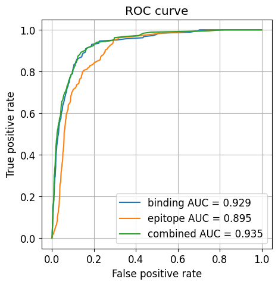
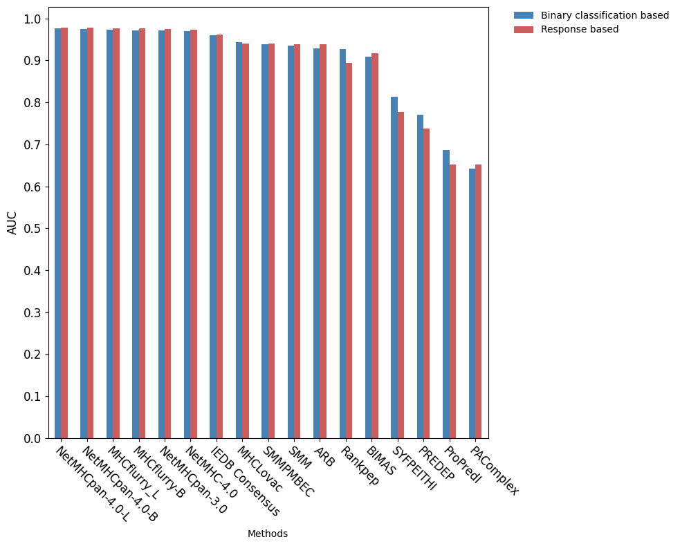
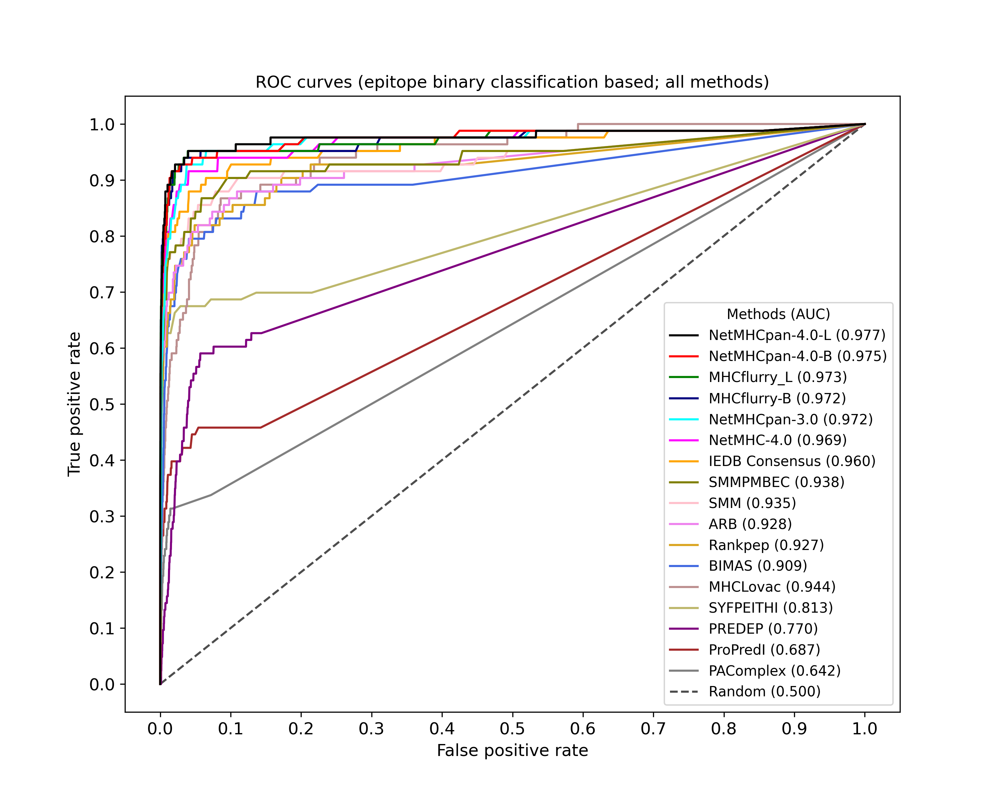
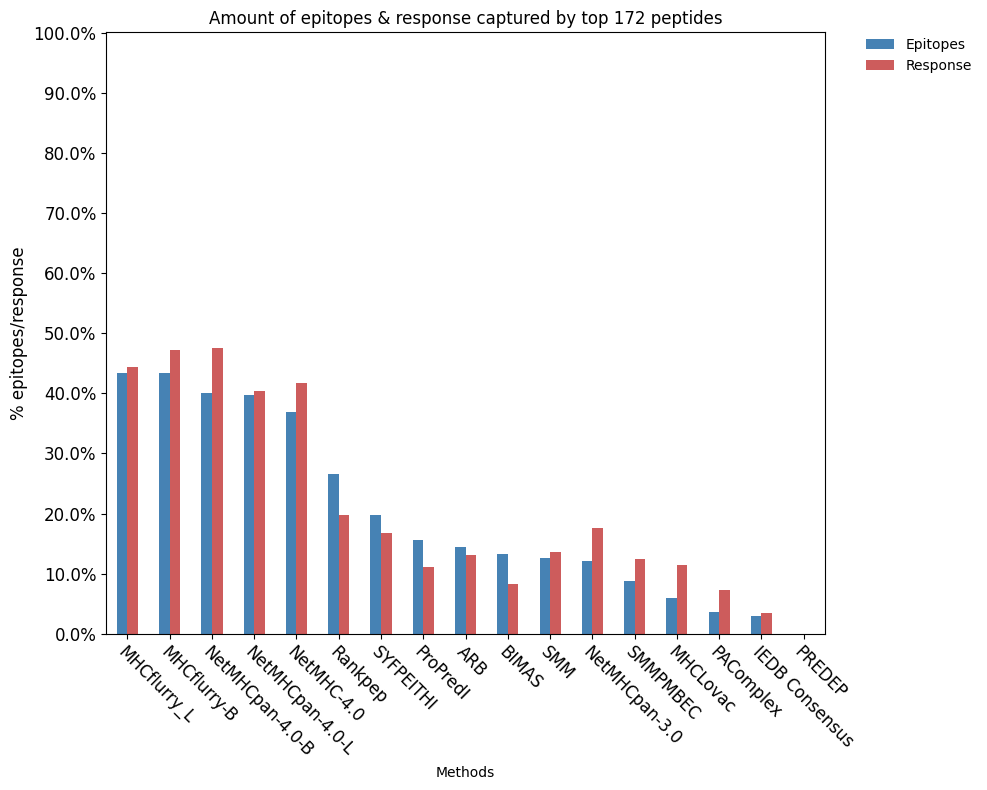

# Benchmarking

MHCLovac is benchmarked using data downloaded from NetMHCpan [[1]](#references) website [http://www.cbs.dtu.dk/services/NetMHCpan/](http://www.cbs.dtu.dk/services/NetMHCpan/).
Method for benchmarking I got from Sinu et al. 2020 [[2]](#references) and includes evaluating the ROC curve. 
True epitopes are extracted from fasta header lines, along with corresponding MHC allele. 
The negative set was generated by chopping each sequence into peptides and excluding the corresponding true epitope. 
In a sense the negative set is not necessarily truly negative since it might contain peptides that can be epitopes. 
Therefore the performance of MHCLovac may not be accurately reflected by this benchmark and might be even better if a better true negative set was used. 
For the purpose of this benchmark a subset of 200 sequences was randomly selected. 

In addition, I benchmarked MHCLovac using IEDBs automated benchmarking framework. 
It can be found here: [https://gitlab.com/iedb-tools/cd8-t-cell-epitope-prediction-benchmarking](https://gitlab.com/iedb-tools/cd8-t-cell-epitope-prediction-benchmarking).
Here are some results. MHCLovac v3 preformed better than previous versions but it is still behind state-of-the-art prediction tools. 

### References
* [1] NetMHCpan-4.1 and NetMHCIIpan-4.0: Improved predictions of MHC antigen presentation by concurrent motif deconvolution and integration of MS MHC eluted ligand data
* [2] Paul, Sinu et al. “Benchmarking predictions of MHC class I restricted T cell epitopes in a comprehensively studied model system.” PLoS computational biology vol. 16,5 e1007757. 26 May. 2020, doi:10.1371/journal.pcbi.1007757

